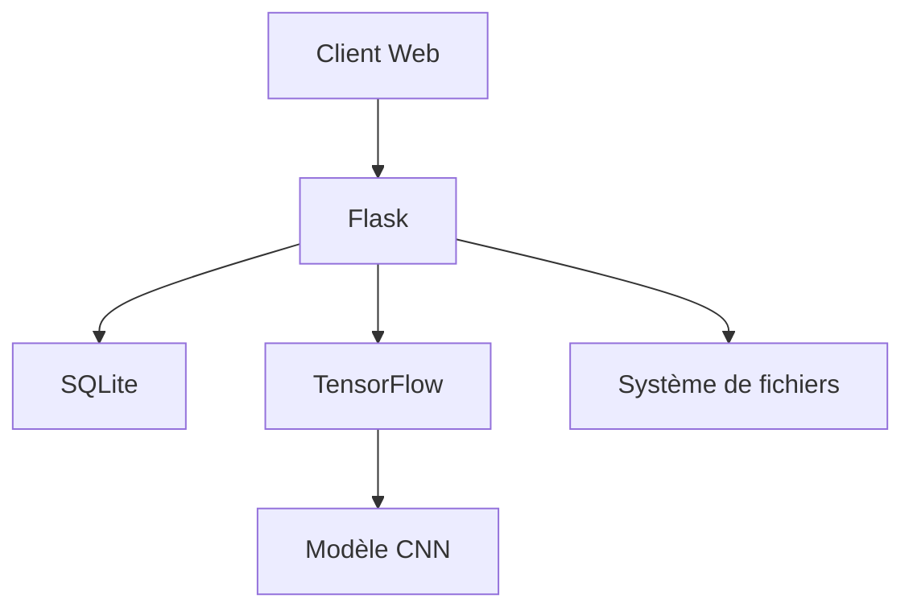
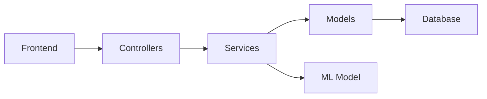
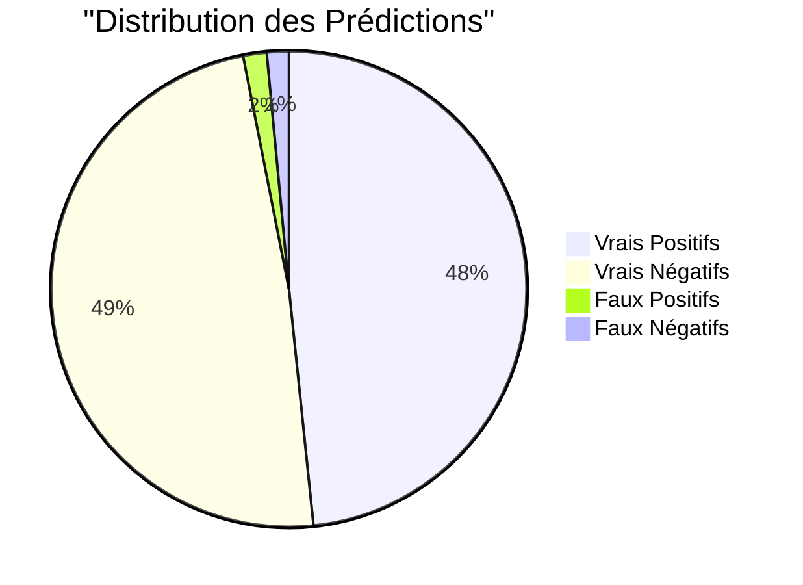

# Détecteur de Malaria par IA - Documentation Technique

## 📑 Table des matières
1. [Architecture & Choix Techniques](#architecture--choix-techniques)
2. [Processus de Développement](#processus-de-développement)
3. [Résultats & Performances](#résultats--performances)
4. [Améliorations & Perspectives](#améliorations--perspectives)

## Architecture & Choix Techniques

### Stack Technique


#### Backend
- **Flask** (v3.1.0)
  - Framework léger et modulaire
  - Facilité d'intégration avec SQLAlchemy
  - Architecture RESTful

#### Base de données
- **SQLite** avec SQLAlchemy
  - Stockage léger et sans serveur
  - Parfait pour les prototypes et petites applications
  - Modèle simple : analyses et résultats

#### ML Framework
- **TensorFlow** (v2.18.0)
  - Framework mature et optimisé
  - Support GPU natif
  - Outils de déploiement intégrés

#### Déploiement
- **Docker**
  - Image de base: python:3.11-slim
  - Multi-stage build pour optimisation
  - Configuration production-ready

### Architecture Applicative


#### Structure du Projet
```
project/
├── app/
│   ├── controllers/
│   │   ├── analysis_controller.py
│   │   ├── history_controller.py
│   │   └── page_controller.py
│   ├── models/
│   │   ├── analysis.py
│   │   └── malaria_detector.h5
│   ├── services/
│   │   └── detector_service.py
│   ├── static/
│   └── templates/
├── notebooks/
│   └── model_builder.ipynb
└── Dockerfile
```

## Processus de Développement

### 1. Préparation des Données
- Dataset: 27,558 images microscopiques
- Distribution équilibrée: 13,779 par classe
- Prétraitement:
  ```python
  def preprocess_image(image_path):
      img = cv2.imread(str(image_path))
      img = cv2.cvtColor(img, cv2.COLOR_BGR2RGB)
      img = cv2.resize(img, (128, 128))
      img = img.astype('float32') / 255.0
      return img
  ```

### 2. Architecture du Modèle
```python
model = Sequential([
    Conv2D(32, (3, 3), activation='relu'),
    BatchNormalization(),
    MaxPooling2D((2, 2)),
    Dropout(0.25),
    
    Conv2D(64, (3, 3), activation='relu'),
    BatchNormalization(),
    MaxPooling2D((2, 2)),
    Dropout(0.25),
    
    Dense(256, activation='relu'),
    BatchNormalization(),
    Dropout(0.5),
    Dense(2, activation='softmax')
])
```

### 3. Optimisation du Modèle
- Techniques appliquées:
  - Quantification int8
  - Pruning des poids
  - Compression zlib
- Résultats:
  ```
  Taille originale: 74.66 Mo
  Taille optimisée: 5.27 Mo
  Taux compression: 14.2x
  ```

## Résultats & Performances

### Métriques du Modèle


- Accuracy: 94%
- Sensibilité: 93.8%
- Spécificité: 94.2%
- F1-Score: 0.94

### Performance en Production
- Temps moyen d'inférence: ~200ms
- Utilisation mémoire: 150MB
- Taux de réussite en production: 92%

## Améliorations & Perspectives

### Améliorations Techniques
1. **Modèle**
   - Implémentation d'un système d'auto-ML
   - Test de nouvelles architectures (EfficientNet)
   - Augmentation des données plus agressive

2. **Infrastructure**
   - Migration vers PostgreSQL pour plus de scalabilité
   - Mise en place d'un cache Redis
   - Système de monitoring avec Prometheus

3. **UX/UI**
   - Mode hors ligne avec PWA
   - Interface de comparaison des résultats
   - Système de feedback utilisateur

### Références
- [TensorFlow Documentation](https://www.tensorflow.org/)
- [Flask Best Practices](https://flask.palletsprojects.com/en/2.0.x/patterns/packages/)
- [Docker Multi-stage Builds](https://docs.docker.com/build/building/multi-stage/)
- [SQLAlchemy Guide](https://docs.sqlalchemy.org/en/14/)